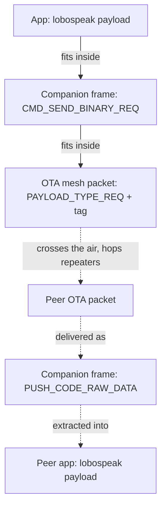
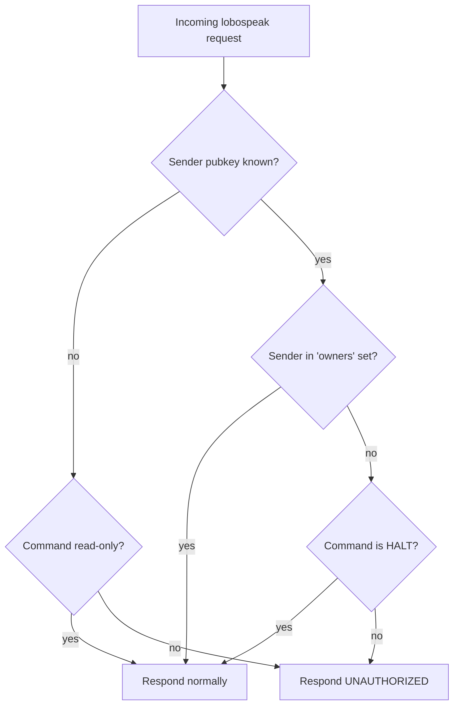
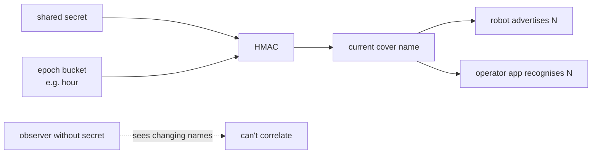
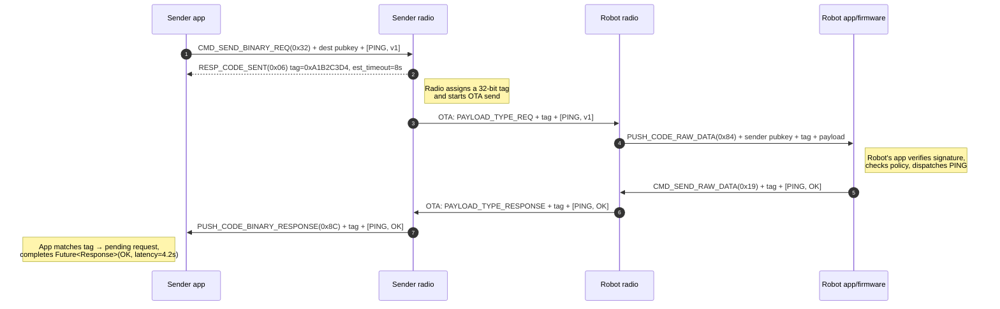
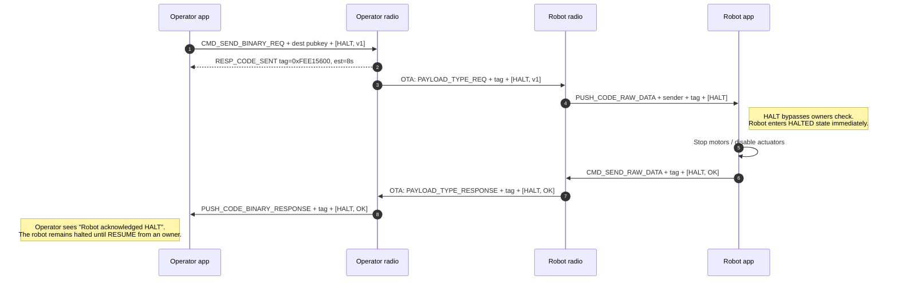

# lobospeak (1805PK)

> *Wolf speak.* A small, opinionated control plane for robots and
> unattended devices over MeshCore — **no side channel required**.
>
> Project codename: **lobospeak**. Compact form: **1805PK**.

**Status:** design — no code yet. This document captures the wire
format, command set, trust model, and interaction patterns so the
implementation can proceed in clean increments.

---

## Why this exists

A control plane for a fleet of robots (or any unattended device) is
usually a separate radio: a LoRaWAN gateway, a private 2.4 GHz mesh,
a cellular modem, an SBC running MQTT. **lobospeak's bet** is that
the MeshCore mesh you're already deploying for human chat carries
enough capability — signed identity, multi-hop unicast routing,
binary req/resp — to *also* be the C2 plane for machines.

**Goal:** issue commands to peers, get structured replies, with
nothing else on the air.

**Non-goals:**

- High-bandwidth control (video, audio, fast PID loops). LoRa is
  ~1–5 kbps even on the fast presets; this is for "go there, take a
  sample, tell me when you're done."
- Real-time guarantees. Multi-hop unicast can take several seconds
  per round trip; designs that need < 1 s response are the wrong
  customer.
- Fleet *coordination* — this is point-to-point command/response,
  not swarm consensus. A higher layer can use lobospeak as the
  transport.

---

## Wire layers

A lobospeak request is a binary blob nested inside three protocol
layers:

1. **OTA mesh packet** — MeshCore's signed, deduplicated, routed
   over-the-air format. Floods or unicasts through repeaters. We
   never construct this ourselves; the radio firmware does.
2. **Companion frame** — the BLE / serial protocol between our app
   and the local radio. `CMD_SEND_BINARY_REQ` (0x32) outbound,
   `PUSH_CODE_BINARY_RESPONSE` (0x8C) inbound. This is the layer
   our codec already touches.
3. **lobospeak payload** — the bytes *inside* the binary req/resp.
   Pure application-level. This is what this document specifies.



The middle layer is set in stone by MeshCore. The outer two layers
are set in stone by MeshCore + LoRa. **Only the innermost layer is
ours to design — that's lobospeak.**

---

## Packet format

### Layer 2: Companion frame (outbound request)

What the app writes to the radio over BLE:


The radio firmware ignores the bytes after the pubkey — it
unicasts them through the mesh to `pubkey`. **lobospeak owns those
trailing bytes.**

### Layer 2: Companion frame (inbound response)

What the radio writes back to the app:


The `tag` is generated by *our* radio when the original request
went out — `RESP_CODE_SENT (0x06)` returned it. The app keeps a
`tag → (peer, command, deadline)` map so the response can be
correlated. No originator pubkey is in this frame; the tag is the
only correlator.

### Layer 3: lobospeak request payload

The bytes the app appends after the destination pubkey:


### Layer 3: lobospeak response payload

The bytes the peer's app puts inside its response:


**Payload budget.** The OTA packet has a hard cap (~256 B at the
common SF7/BW125 preset, less at higher SF). After OTA headers,
signatures, and routing path, you have **~180 B of lobospeak
payload to play with.** Most commands fit in 4–32 B; the budget
becomes a concern only for `GOTO` waypoint lists or `SAMPLE` raw
sensor dumps.

---

## Command set v1

| Code | Name | Args | Response `data` | Notes |
|---|---|---|---|---|
| `0x01` | **PING** | empty | empty | Alive check; round-trip latency is the answer. |
| `0x02` | **IDENT** | empty | model UTF-8, ≤32 B + capability bitmask u16 | "What kind of robot are you, what can you do." |
| `0x03` | **STATE** | empty | `[state u8][task_id u16][progress_pct u8]` | Coarse state machine: idle / executing / fault / charging. |
| `0x04` | **HALT** | empty | empty | Emergency stop. **Bypasses ownership check** (safety). Response = ack only. |
| `0x05` | **RESUME** | empty | empty | Exit halt. Restricted. |
| `0x06` | **TASK_START** | `[task_kind u8][args N B]` | `[task_id u16]` | Begin a named task; robot returns its assigned id. |
| `0x07` | **TASK_STOP** | `[task_id u16]` | empty | Cancel a specific task. |
| `0x08` | **TASK_QUERY** | `[task_id u16]` | `[state u8][progress_pct u8][result_N B]` | Poll a task's state. |
| `0x09` | **GOTO** | `[lat s32][lon s32][alt_m s16][speed u8]` | `[task_id u16]` | Navigate to a waypoint. Returns task id for monitoring. |
| `0x0A` | **SAMPLE** | `[sensor_id u8][modifier u8]` | `[ts u32][reading_N B]` | Take and report a sensor reading. |
| `0x10` | **GET_PARAM** | `[key UTF-8, ≤16 B]` | UTF-8 value | Read a runtime parameter (e.g. `gain`, `safety_radius_m`). |
| `0x11` | **SET_PARAM** | `[key:value UTF-8, ≤180 B]` | empty | Write a parameter. Restricted. |
| `0x20` | **ECHO** | bytes | same bytes | Debug; useful for tag/timing tests. |
| `0x80`–`0xFE` | (reserved) | | | Application-specific extensions. Use the high bit to claim a private code; no central registry. |
| `0xFF` | (sentinel) | — | — | Never sent; reserved as an "unknown command" placeholder. |

### Status byte

Universal across all responses:

| Code | Meaning |
|---|---|
| `0x00` | OK |
| `0x01` | UNKNOWN_COMMAND |
| `0x02` | UNAUTHORIZED |
| `0x03` | BUSY (try again later) |
| `0x04` | BAD_ARGS |
| `0x05` | UNSUPPORTED_VERSION |
| `0x06` | FAULT (robot is in a fault state) |
| `0x07` | TIMEOUT (internal — robot's own operation timed out) |

A peer that *can't* answer a command (because they don't speak
lobospeak at all) will simply not reply. That's indistinguishable
from "the message never reached them"; our side times out after
the OTA-roughly-bounded deadline and surfaces TIMEOUT.

### Versioning

Each command carries its own `vers` byte. v1 of every command is
`0x01`. If we change the shape of `GOTO`'s args (e.g. add altitude
tolerance), `GOTO v2` ships alongside v1, peers respond
`UNSUPPORTED_VERSION` if they only speak v1, and the sender drops
back. Never overload a `vers` byte to mean "extension flags";
that's a separate codebook.

---

## Trust model

MeshCore's OTA layer signs every packet with Ed25519. The receiver
firmware verifies before passing the packet up to the peer's app
via `PUSH_CODE_RAW_DATA`, so by the time lobospeak sees a request,
**the sender's pubkey identity is cryptographically established.**

On top of that identity, the robot's app applies a policy table:



**The two privileged tiers:**

- **`owners`** — pubkeys explicitly added (a QR-code import, or a
  manual paste on commissioning) that may issue *any* command,
  including `SET_PARAM`, `GOTO`, `TASK_START`.
- **Anyone** (including unknown peers) — may issue **read-only**
  commands (`PING`, `IDENT`, `STATE`, `SAMPLE` if marked safe,
  `GET_PARAM` for non-secret keys) and **`HALT`**.

The HALT exception is a deliberate safety choice: if a robot is
about to drive off a cliff, a passing operator with no prior
relationship should still be able to stop it. The cost is that
HALT can also be abused for denial-of-service. Robots may rate-
limit HALT (e.g. accept it from a sender at most once per minute)
and surface a "halted by `pubkey...`" log so operators can audit
afterward.

Robots may also maintain a **`blocklist`** of pubkeys whose
requests are silently ignored — useful when a known-bad actor is
on the mesh.

---

## Network scoping — closed deployments only

lobospeak is a **closed-network** protocol. It is **never** served
on the `Public` channel, and the read-only/HALT-for-anyone tier
above is a *deployment choice*, not a default.

Two layers define "closed":

1. **A private channel.** lobospeak traffic rides a dedicated
   channel whose PSK only the operators + their robots hold.
   Membership in that channel is membership in the control plane.
   Anyone without the key can't even decrypt the packets, let alone
   issue commands. (Binary req/resp is pubkey-unicast and
   per-DM-ECDH-encrypted regardless, but pinning lobospeak to a
   private channel keeps the *whole surface* off the public mesh —
   including any future broadcast commands.)
2. **An owners pubkey set.** Even within the private channel, state-
   changing commands require the sender to be in `owners`.

**Hard rule: a lobospeak handler must refuse to operate on the
`Public` channel.** If a binary request arrives whose context is
the Public channel (or whose originating channel can't be
established as the private control channel), the robot ignores it
silently. Rationale: a public channel is, by definition, full of
strangers; exposing a robot command surface there is an invitation
to abuse, and even read-only `IDENT`/`STATE` leaks fleet
composition to anyone listening.

Practical consequence for the trust model: in a pure closed
deployment you can collapse the tiers — **owners-only for
everything, including HALT.** The "anyone may HALT" safety valve is
appropriate for a semi-open civic deployment (a community robot a
bystander should be able to stop); for a private industrial fleet
you'd turn it off so a stranger on a shared band can't wedge your
robots. Make it a per-deployment config flag:
`allowAnonymousHalt` (default **off** for closed networks).

---

## Identity, anonymity, and name shifting

Robots may **rotate their advertised names** on a schedule to
frustrate passive tracking. An observer watching the mesh sees a
node whose display name keeps changing and can't easily build a
movement history keyed on "the robot called `ROVER-3`."

**Two ways to run the rotation:**

- **Pre-shared list.** Operators + robot share an ordered list of
  cover names; the robot advances on a schedule. Operators hold the
  list, so they always know the current alias. Simple, but the list
  is finite and must be redistributed when exhausted.
- **Keyed time-derived names** *(recommended)*. The name is
  `truncate(HMAC(shared_secret, epoch_bucket))` mapped to a
  pronounceable token. The robot and every operator compute the
  same name from the shared secret + current time bucket — no list
  to distribute, self-synchronising, and an observer without the
  secret can neither predict the next name nor link two names to
  one robot.



**The honest limit — name shifting hides the *name*, not the
*key*.** MeshCore identity is a fixed Ed25519 keypair; every advert
is signed by it, so a determined observer tracks the robot by
**pubkey** regardless of the display name. Name rotation defeats
casual, name-based tracking (someone skimming a node list), not a
adversary correlating signatures.

For true unlinkability the robot would have to **rotate its
identity keypair** too, with operators able to recompute or
recognise each successive pubkey from a shared seed (e.g. derive
ephemeral keypairs `k_epoch = KDF(seed, epoch)`). That fights
MeshCore's fixed-identity model and the contact/path machinery that
assumes a stable pubkey — so it's explicitly a **v2/advanced**
concern, flagged here so the name-shifting feature isn't mistaken
for full anonymity.

**Operator-side implication:** the operator app must key robots by
**pubkey**, never by display name. The current name is just a label
that happens to change; identity, ownership, command authorisation,
and the `owners` set are all pubkey-based. The app surfaces the
current cover name for human readability but never relies on it for
correlation or trust.

---

## Interaction patterns

### Happy path — sender pings a robot, robot responds



### Timeout — unreachable or unresponsive peer

```mermaid
sequenceDiagram
    autonumber
    participant App as Sender app
    participant Radio as Sender radio
    participant PRadio as Robot radio (offline / out of range)

    App->>Radio: CMD_SEND_BINARY_REQ + dest pubkey + [STATE, v1]
    Radio-->>App: RESP_CODE_SENT tag=0xCAFEBABE, est_timeout=12s
    Radio->>PRadio: OTA: ... (no ACK, retries with backoff)
    Note over Radio: No PAYLOAD_TYPE_RESPONSE arrives
    Note over App: App's deadline (12s + grace) expires
    App->>App: Future completes with TIMEOUT;<br/>tag cleared from pending map
```

The app uses the `est_timeout` value from `RESP_CODE_SENT` as a
hint, then adds a grace margin (e.g. 1.5× or a fixed 4 s) before
giving up. The radio firmware itself may retry the OTA send; the
companion-layer timeout is bounded by hop count and modulation.

### Unauthorized — robot rejects a state-changing command

```mermaid
sequenceDiagram
    autonumber
    participant App as Sender app
    participant Radio as Sender radio
    participant PRadio as Robot radio
    participant PApp as Robot app

    App->>Radio: CMD_SEND_BINARY_REQ + dest pubkey + [GOTO, v1, ...]
    Radio-->>App: RESP_CODE_SENT tag=0xDEADC0DE, est=10s
    Radio->>PRadio: OTA: PAYLOAD_TYPE_REQ + tag + [GOTO, v1, ...]
    PRadio->>PApp: PUSH_CODE_RAW_DATA + sender pubkey + tag + payload
    Note right of PApp: Policy: sender NOT in owners,<br/>GOTO is state-changing
    PApp->>PRadio: CMD_SEND_RAW_DATA + tag + [GOTO, UNAUTHORIZED]
    PRadio->>Radio: OTA: PAYLOAD_TYPE_RESPONSE + tag + [GOTO, UNAUTHORIZED]
    Radio->>App: PUSH_CODE_BINARY_RESPONSE + tag + [GOTO, UNAUTHORIZED]
    Note left of App: Future completes(UNAUTHORIZED);<br/>UI shows "Robot rejected GOTO — not an owner"
```

### HALT — emergency broadcast, fire-and-acknowledge



### Multi-robot fan-out — one button, N requests

```mermaid
sequenceDiagram
    autonumber
    participant Op as Operator
    participant App as Operator app
    participant Radio as Operator radio
    participant R1 as Robot A
    participant R2 as Robot B
    participant R3 as Robot C

    Op->>App: Tap "STATE all"
    par parallel issue
        App->>Radio: CMD_SEND_BINARY_REQ → A + [STATE]
        Radio-->>R1: OTA
        and
        App->>Radio: CMD_SEND_BINARY_REQ → B + [STATE]
        Radio-->>R2: OTA
        and
        App->>Radio: CMD_SEND_BINARY_REQ → C + [STATE]
        Radio-->>R3: OTA
    end
    Note over Radio: Each tag is independent;<br/>responses can arrive in any order
    R1-->>Radio: [STATE, OK, idle]
    R3-->>Radio: [STATE, OK, executing 47%]
    Note over R2: B is out of range — no response
    Radio-->>App: PUSH 0x8C tag=A → completes A's Future
    Radio-->>App: PUSH 0x8C tag=C → completes C's Future
    Note over App: B's Future times out after est+grace
```

The companion radio queues outbound binary requests internally;
the app shouldn't need to rate-limit unless OTA airtime starts to
matter for a large fleet (>20 robots in a single fan-out).

---

## Robot-side implementation notes

Two viable architectures depending on what's between the radio and
the actuators:

### A. Radio runs custom firmware (no phone, no SBC)

The robot's MeshCore radio is a custom build with lobospeak
handlers compiled in. `onContactRequest()` in firmware dispatches
on `cmd` and `vers` directly, drives motors / sensors via the
radio's GPIO / I²C / UART, and writes the response to `reply`.

**Pros:** simplest physical assembly; lowest power.
**Cons:** every behaviour change means a firmware re-flash; debug
is hard without a serial console.

### B. Radio + companion SBC (RPi, ESP32, microcontroller)

The MeshCore radio is stock firmware; the SBC is its "app." The
radio forwards inbound requests to the SBC via `PUSH_CODE_RAW_DATA`,
the SBC runs the dispatcher (which can be a thin Python or Rust
program), and writes responses back via `CMD_SEND_RAW_DATA`.

**Pros:** behaviours change without re-flashing the radio; SBC
can do heavy lifting (path planning, ML inference) before
responding.
**Cons:** another component to provision and power.

Either way, the **wire format above is unchanged.** A robot
running architecture A and a robot running architecture B are
interoperable from the operator's perspective.

---

## Compatibility with stock MeshCore

A peer running stock MeshCore firmware (no lobospeak handler) will
*not* respond to any lobospeak command other than the implicit
"the firmware delivers it to the peer's app via 0x84." On a phone
running Meshtastic-style chat clients, that push lands in their
app's raw-data hook (often unused) and disappears.

**The operator's app sees this as a TIMEOUT** — indistinguishable
from "peer is offline." That's intentional: lobospeak is opt-in
on both sides, and a non-lobospeak peer remains a normal mesh
neighbour for chat / position / telemetry.

For a robot to be lobospeak-addressable, **its app or firmware
must run a lobospeak handler.** The reference handler lives in
Meshmore SNS for phone-attached devices; the bare-metal handler
(architecture A) is the next thing to build after the codec.

---

## Threat model

A short list of what lobospeak *does* and *doesn't* defend against
on the air.

| Threat | Defence | Residual risk |
|---|---|---|
| Forged sender identity | Ed25519 signature on every OTA packet (MeshCore layer) | None at this layer |
| Replay of a captured request | MeshCore packet has a timestamp; receivers reject stale | Short replay window (clock skew) |
| Eavesdropping on a command | Channel-level AES (when the request goes via a channel) | Direct unicast is per-DM ECDH-encrypted — also covered |
| Compromised owner pubkey | None — owners are trusted by definition | Rotate the owner set on commission |
| DoS via HALT flood | Rate-limit HALT per sender on the robot side; `allowAnonymousHalt` off in closed deployments | Slowed; off entirely when anonymous HALT is disabled |
| Robot impersonation in responses | Tag correlation only; an attacker who races a response from a different pubkey could in principle confuse the sender | Verify the response's OTA source pubkey matches the request destination — out-of-scope for stock firmware; an enhancement for lobospeak v2 |
| Command surface exposed to strangers | Private control channel (PSK) + refuse to operate on `Public` | None while the PSK stays secret |
| Passive name-based tracking of robots | Name shifting (keyed time-derived or pre-shared list) | Defeats casual tracking only |
| Passive **pubkey-based** tracking of robots | None at v1 — MeshCore identity is a fixed signed keypair | Full unlinkability needs keypair rotation (v2/advanced) |
| Fleet-composition leak via read-only commands | Owners-only mode (no anonymous `IDENT`/`STATE`) in closed deployments | None when read-only-for-anyone is off |

---

## What gets implemented first

In dependency order, mapping to the build steps from the earlier
design discussion:

1. **Codec** — `CMD_SEND_BINARY_REQ` (0x32) encoder,
   `PUSH_CODE_BINARY_RESPONSE` (0x8C) decoder,
   `PUSH_CODE_RAW_DATA` (0x84) decoder for the inbound side,
   `CMD_SEND_RAW_DATA` (0x19) encoder for the response side. Pure
   `packages/meshcore/` work; testable with hex vectors.

2. **Controller** — `Future<LobospeakResponse> sendCommand(peer,
   cmd, args, {timeout})`. Internal tag-keyed map. Subscribes to
   `PUSH_CODE_BINARY_RESPONSE` frames, completes Futures on tag
   match. Subscribes to `PUSH_CODE_RAW_DATA` for inbound, runs the
   dispatcher.

3. **Dispatcher** — registry of `Map<int, LobospeakHandler>`.
   Built-ins for `PING`, `IDENT`, `STATE`, `HALT`. Apps can add
   their own handlers at runtime.

4. **Policy** — settings screen with the trust tiers; `owners`
   list stored in `shared_preferences`; per-command policy
   toggles.

5. **UI** — start in the node detail sheet with "Ping" / "Get
   state" buttons that fire `sendCommand` and show the result.
   A "Robots" sub-screen for fleet operations comes later.

The bare-metal embedded handler (architecture A) is a separate
project — pure C++ that links against the MeshCore firmware
library. Out of scope for the Meshmore SNS commit train; in scope
for an `examples/lobospeak_robot/` subdir in the firmware fork
eventually.

---

## Open questions

1. **Response source verification.** Today the `0x8C` push carries
   only the tag — there's no pubkey check that the response came
   from the same peer the request went to. The radio firmware's
   OTA layer presumably enforces this (a `PAYLOAD_TYPE_RESPONSE`
   from a stranger gets dropped), but I haven't verified the
   exact rule. **Action:** confirm during step 1 implementation;
   if absent, add a tag → expected-pubkey check on the controller.

2. **Multi-response or streaming.** A `SAMPLE` of a high-rate
   sensor might want to push back multiple frames. Today
   lobospeak is strictly one-shot req/resp. **Action:** v2.
   Convention candidate: response data starts with a `[seq u8][last bit]`
   header.

3. **Broadcast commands.** A "halt all in this channel" would be
   nicer than a fan-out. MeshCore's group-data path
   (`CMD_SEND_CHANNEL_DATA`) could carry a lobospeak payload — no
   per-peer pubkey, channel-encrypted. **Action:** v2; the
   command code space already reserves room.

4. **Authentication of response data.** The OTA layer signs the
   transport, but lobospeak doesn't sign the *application*
   payload separately. A compromised peer device could lie in its
   response. Out of scope unless the threat model demands it.

---

## Map pins & waypoints

**Status:** EARMARK — design only, NOT built. Captured 2026-06-08.
**Full spec:** `lobospeak-mappins-spec.md` — GPS/tag/waypoint/trigger pins,
the pin-keyed rule engine (Class A/B actions + arm/ownership safety), wire
mapping, phasing, and open decisions. The section below is the summary.

lobospeak's whole point is acting on the physical world, and its `GOTO`
command (`0x09`, `[lat s32][lon s32][alt_m s16][speed u8] → [task_id u16]`)
already speaks coordinates. What's missing on the operator side is a way to
**pin a point on the map and act on it** — drop a destination, mark a hazard,
lay down a route — instead of hand-typing lat/lon. Pins are also the
placement UX for geofences (see `meshmore-sns-geofence-tracking.md`).

### Pin model

```
MapPin {
  id, lat, lon,
  label,                         // "rally point", "sample site 3"
  kind: waypoint | marker | hazard | zone-centre | sample,
  source: userDropped | fromNode | fromInferredPlace | fromGoto,
  altM?, createdAt, createdByKey?,   // who placed it (self in v1)
  color?/icon?,
}
Route { id, label, ordered [pinId…] }   // a sequence of waypoints
```

Store: `map_pin_store.dart` — SharedPreferences JSON, the established
`abstract final class` store pattern. Scope: **global** (pins outlive any one
channel). Pins are the explicit, highest-confidence cousin of place
inference's `InferredMarker` (lat/lon + label + metadata) — confidence is
implicit 1.0 because the user placed it. A neat bridge: **promote an inferred
place to a pin** (one tap on a low-confidence inferred marker fixes it).

### Placement UX (hyperlocal grid / map modes)

- **Long-press** anywhere on a map-like grid mode → drop a pin at that
  lat/lon (reverse the existing projection used to plot nodes).
- **Pin a node's position** from the node detail sheet ("mark this spot").
- **Promote an inferred place** (R54 marker) → a fixed pin.
- **Enter coordinates / Maidenhead grid** (reuse the place-inference
  coordinate + grid-locator parsers).
- Edit: drag to nudge, rename, recolour, set kind, delete. A pins layer
  renders across the map-like `_GridViewMode`s; per-theme via `context.skin`.

### lobospeak integration (the payoff)

- **Send a pin as `GOTO`:** from a pin (or the robot's node sheet) → pick a
  peer robot → encode `GOTO [lat][lon][alt][speed]`, await the `task_id`,
  then poll `TASK_QUERY`. The pin becomes a live destination with a "robot en
  route / arrived" state on the map.
- **A `Route` = ordered waypoints** → a sequence of `GOTO`s (or, later, a
  multi-waypoint app-extension command in the `0x80–0xFE` space, mindful of
  the ~180 B payload budget — most routes of a handful of points fit).
- **`SAMPLE` results pinned:** a `0x0A SAMPLE` response can be dropped as a
  `sample`-kind pin at the robot's reported position (a sensor map builds up).
- All of this stays **closed-network** — pins/waypoints ride the private
  control channel and owners rules; **never Public** (lobospeak's hard rule).

### Sharing pins with the team (later)

v1 pins are **local-only**. v2: broadcast a pin/route to teammates as a
lobospeak app-extension command on the closed channel — the same path the
geofence "share a zone" phase wants. Until then, pins are a personal operator
overlay. Cross-links: [[geofence-node-tracking]] (a pin + radius = a fence
centre), place inference (the marker model + parsers to reuse).

### Phasing

- **P1:** MapPin model + store; drop / edit / delete pins; render the pins
  layer on the grid; coordinate + grid-locator entry.
- **P2:** send a pin as `GOTO` to a peer (needs the lobospeak codec +
  controller); live destination/arrival state; pin a `SAMPLE` result.
- **P3:** `Route` (ordered waypoints) → GOTO sequence; promote-inferred-place;
  pin-centred geofences (converge with the tracking/geofence design).
- **P4:** share pins/routes over the closed control channel.

---

## Glossary

- **lobospeak** — the human-friendly project name.
- **1805PK** — the compact form (literally 1337 for `lobospeak`,
  abbreviated). Use in tight UI labels or log prefixes.
- **owner** — a pubkey explicitly granted state-change rights on
  a robot.
- **control channel** — the private MeshCore channel (its own PSK)
  that scopes a lobospeak deployment. Membership = holding the key.
- **cover name** — a rotating advertised display name a robot uses
  to frustrate name-based tracking; recognised by operators via a
  shared secret, opaque to observers.
- **`allowAnonymousHalt`** — per-deployment flag. Off (closed
  fleets): only owners may HALT. On (semi-open/civic): any signed
  peer may HALT as a safety valve.
- **tag** — the 32-bit identifier our radio mints per outbound
  binary request; the only correlator for the eventual response.
- **OTA** — over the air; the LoRa packet that flies between
  radios.
